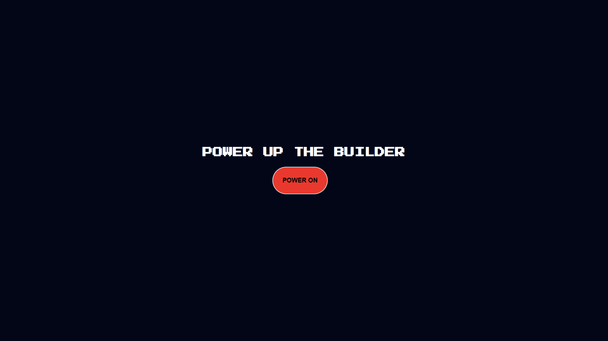
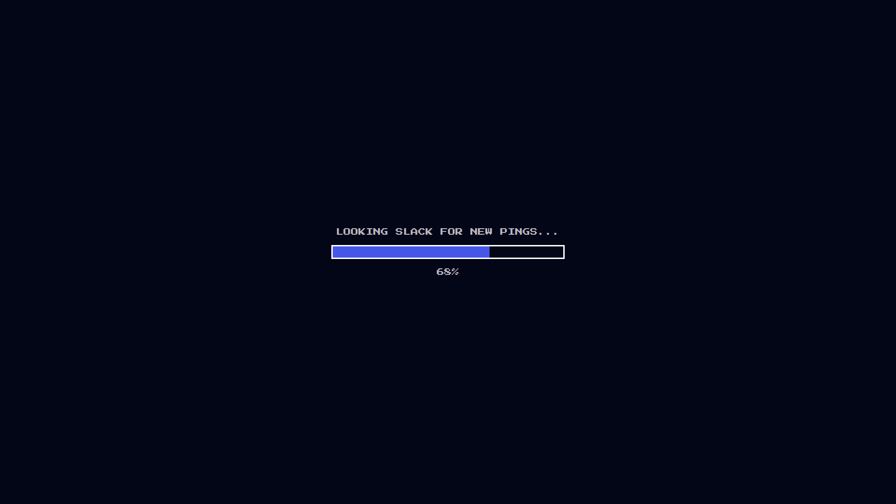
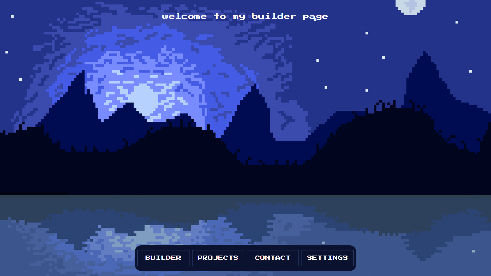
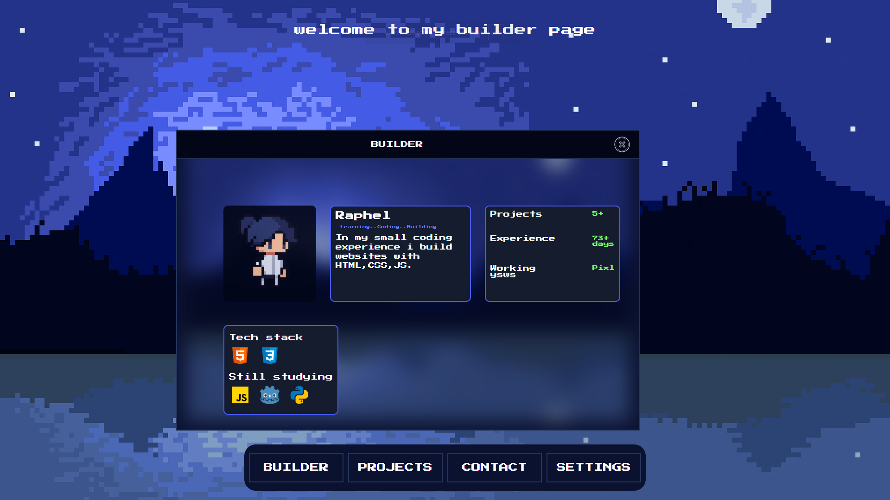
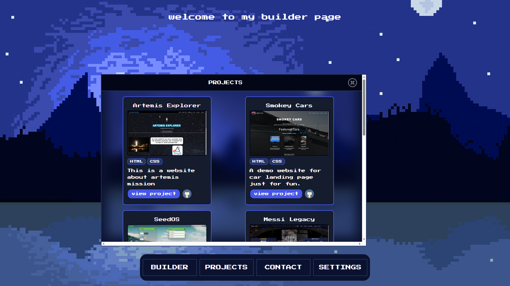
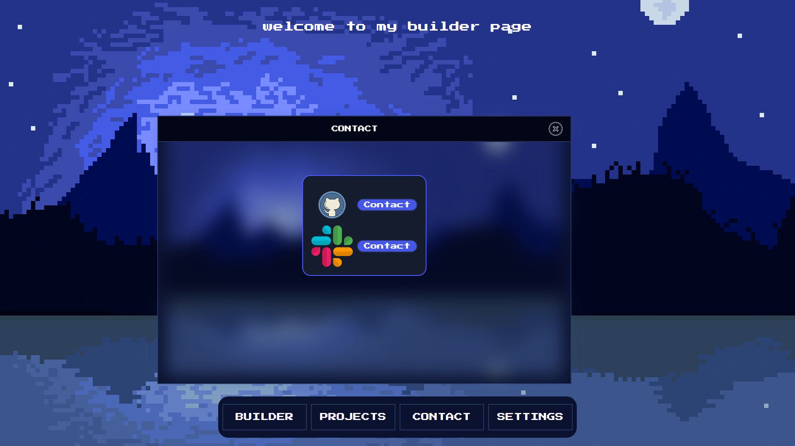
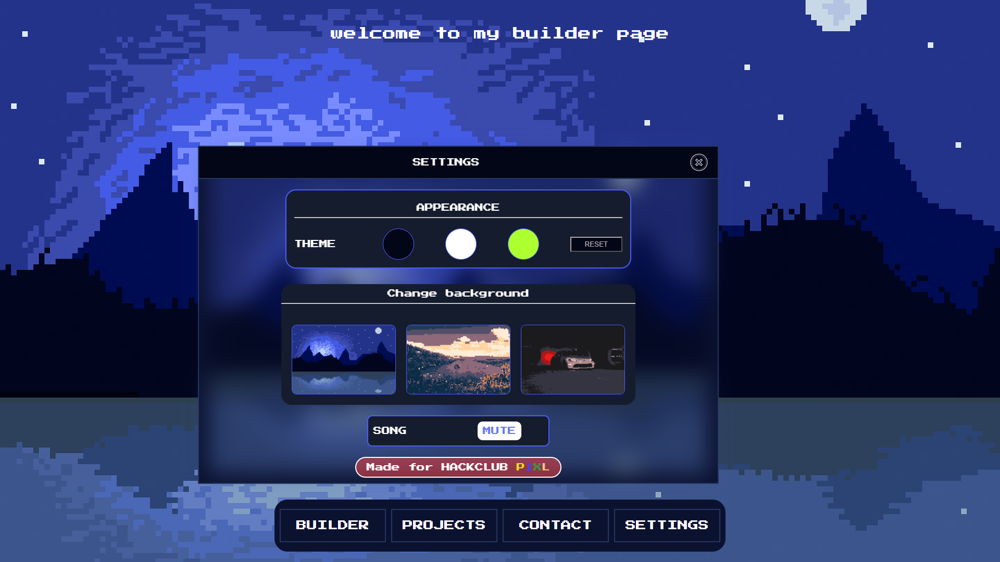
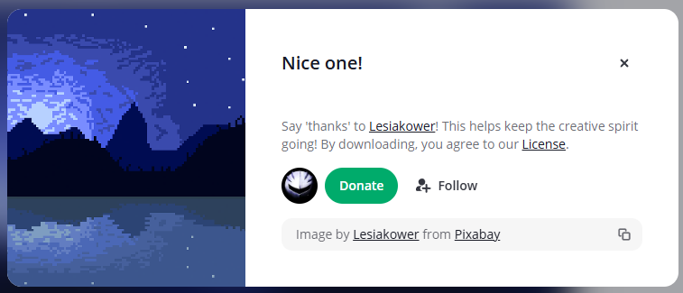
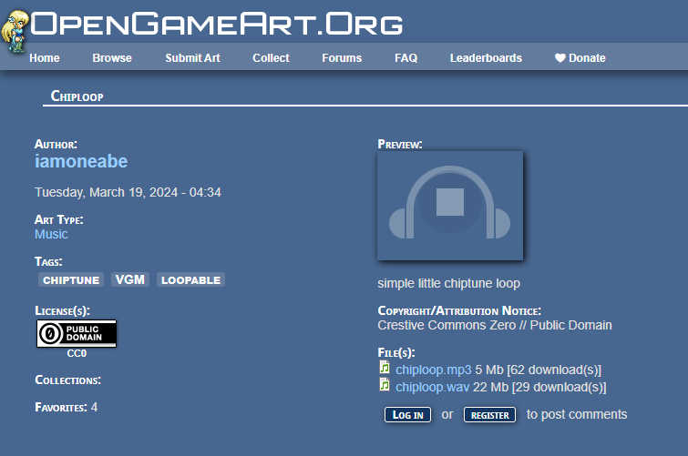
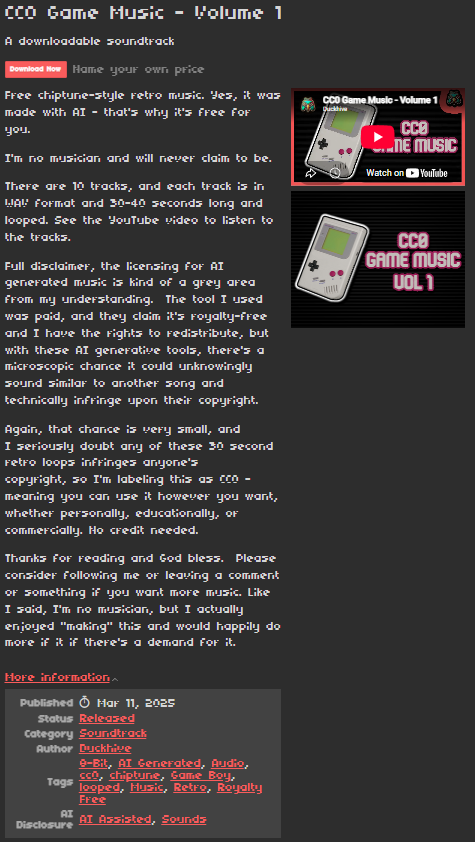

# Builder-Signal

This is my builder webpage it's like a portfolio but different it includes the information of
 aboutme, the projects i build ,and customiseable theme.I build this one in a PIXEL theme inspired by pixl.hackclub.
It is very intersting to build this project at the first i just wanted  to create a normal portfolio but that learns me nothing
so i thinked it different and i added some idea from the concept of webos,which i already finished which is seedos,that project help me alot building this.I sketched the intro window to main window by my own.The javascript and css aligning confuse a little bit but i manage to cover that.


## Live Demo

[Open the live website](https://raphelreji.github.io/Builder-Signal/)

## Screenshots









## Features

- Interactive design
- Responsable
- Booting window
- 2 Musics
- Text animations
- Customisable theme
- Like a portfolio but build different
- Click the github icon in projects to view that project

## Installation to run locally

1. Clone this repository:
```bash
git clone https://github.com/RaphelReji/Builder-Signal.git
```
Repository url:
```bash
git clone https://github.com/RaphelReji/Builder-Signal
```

2. Open the project folder in VS Code or any code editor.

3. Open `index.html` in your browser.


### How It Works
You want to explore through my builder page, customise the theme, look out projects and more...

## Design

A PIXEL themed website even the font is pixel themed.

## What I Learned
- loading bar and music play pause with javascript

## Credits



 
 - image of profile:Taken from pixl game
 - icons:Taken from icon8
 - converted real backgrounds to pixelated by pixelit website.
 - if i forgot to credit you sorry and thanks!

 ## License

This project was created under MIT-do what ever with it.
